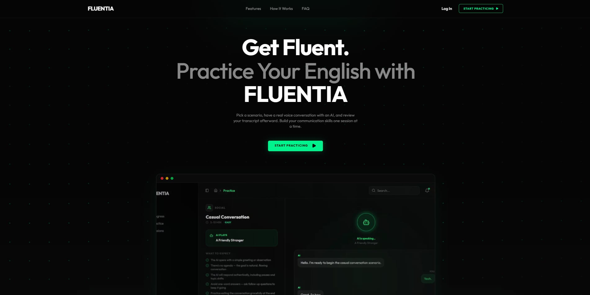
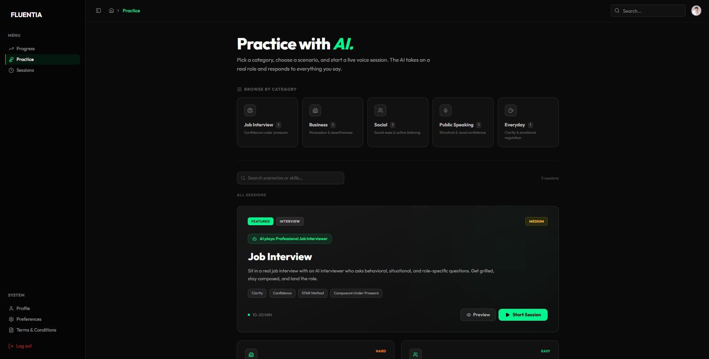
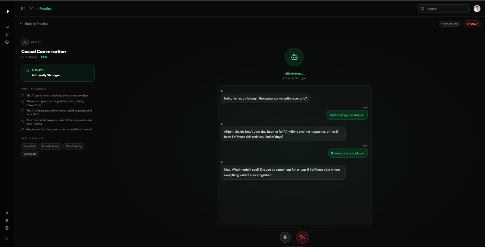
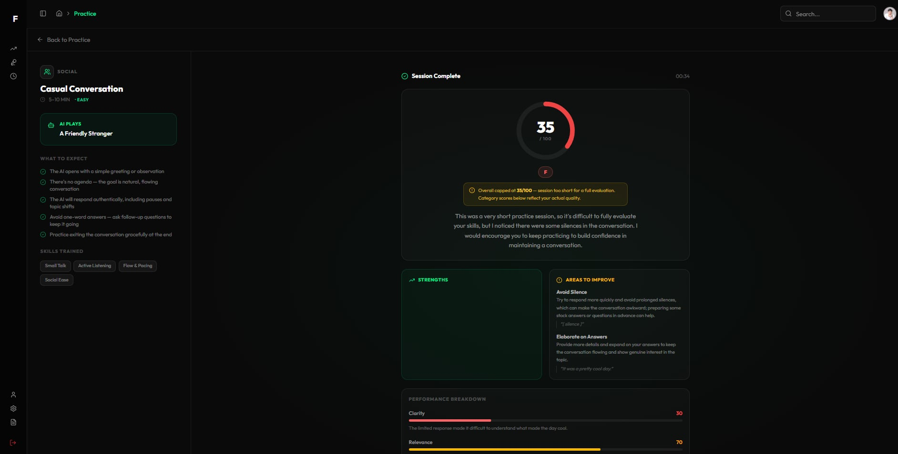
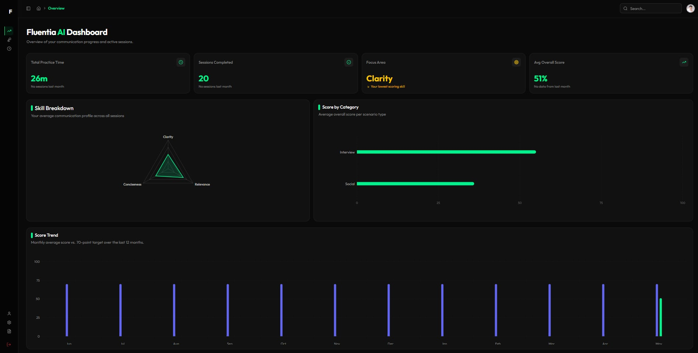

# Fluentia

> AI-powered communication coaching through real-time voice roleplay.

Fluentia lets you practice high-stakes conversations — job interviews, client calls, presentations, everyday social situations — with an AI coach that listens, responds, and gives you a detailed performance report after every session.



---

## Features

- **Scenario-based voice roleplay** — choose from curated scenarios across five categories: Interview, Business, Social, Public Speaking, and Everyday
- **Live AI voice sessions** — speak naturally with an AI agent powered by Vapi + ElevenLabs; the AI adapts its role and tone to the scenario
- **Post-session feedback** — scored across Clarity, Relevance, and Conciseness with filler-word tracking; report generated by Gemini 2.0 Flash
- **Progress dashboard** — visualize improvement over time with session history and trend charts
- **Coaching preferences** — calibrate scoring difficulty (skill level), evaluation style, speaking goals, feedback depth, and feedback tone

---

## Screenshots

| Scenario Browser | Live Session |
|---|---|
|  |  |

| Post-Session Feedback | Dashboard |
|---|---|
|  |  |

---

## Tech Stack

| Layer | Technology |
|---|---|
| Framework | Next.js 16 (App Router) · React 19 · TypeScript |
| Styling | Tailwind CSS v4 · shadcn/ui · Framer Motion |
| Auth & DB | Supabase (auth + Postgres) |
| Voice | Vapi AI · ElevenLabs |
| AI Feedback | Google Gemini 2.0 Flash |
| Charts | Recharts |
| Analytics | Vercel Analytics |

---

## Getting Started

### Prerequisites

- Node.js 18+
- A [Supabase](https://supabase.com) project
- A [Vapi](https://vapi.ai) account with a public key

### 1. Clone and install

```bash
git clone https://github.com/your-username/fluentia-2026.git
cd fluentia-2026
npm install
```

### 2. Configure environment variables

Create `.env.local` in the project root:

```env
NEXT_PUBLIC_SUPABASE_URL=your_supabase_project_url
NEXT_PUBLIC_SUPABASE_PUBLISHABLE_KEY=your_supabase_anon_key
NEXT_PUBLIC_VAPI_PUBLIC_KEY=your_vapi_public_key
```

### 3. Run the development server

```bash
npm run dev
```

Open [http://localhost:3000](http://localhost:3000).

---

## Project Structure

```
src/
├── app/
│   ├── dashboard/          # All authenticated routes
│   │   ├── practice/       # Scenario browser + live session
│   │   ├── sessions/       # Session history
│   │   ├── feedback/       # Post-session report detail
│   │   ├── profile/        # User profile
│   │   └── preferences/    # Coaching settings
│   ├── authentication/     # Login, register, forgot password
│   └── api/feedback/       # Gemini feedback generation endpoint
├── components/
│   ├── dashboard/          # Dashboard-specific components
│   └── ui/                 # shadcn/ui primitives
├── data/scenarios.ts       # Static scenario definitions
├── hooks/use-vapi-session.ts
└── lib/
    ├── prompts/            # Vapi system prompt builder
    └── voice/              # Vapi client singleton
```

---

## Session Flow

1. Browse scenarios and select one (`/dashboard/practice`)
2. Review the scenario brief and click **Begin Session**
3. Speak naturally — the Vapi AI agent plays its role in real time
4. End the session; the transcript is saved to Supabase
5. Gemini 2.0 Flash analyzes the transcript and generates scored feedback
6. Review your report at `/dashboard/feedback`

---

## Available Scripts

```bash
npm run dev      # Start development server
npm run build    # Production build
npm run start    # Start production server
npm run lint     # Run ESLint
```

---

## License

MIT
